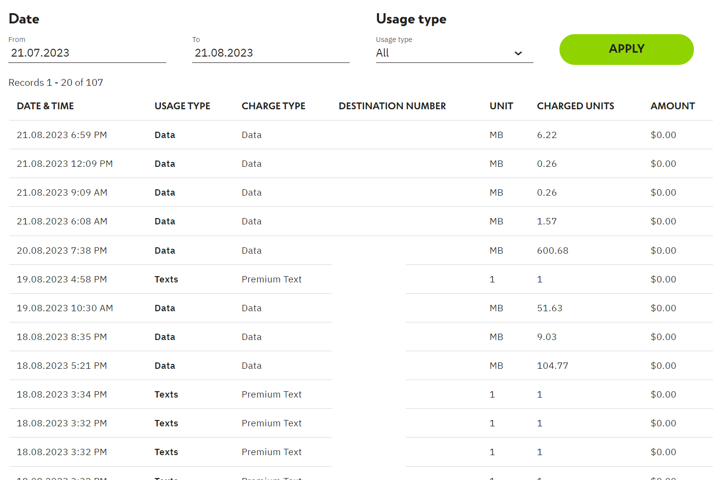
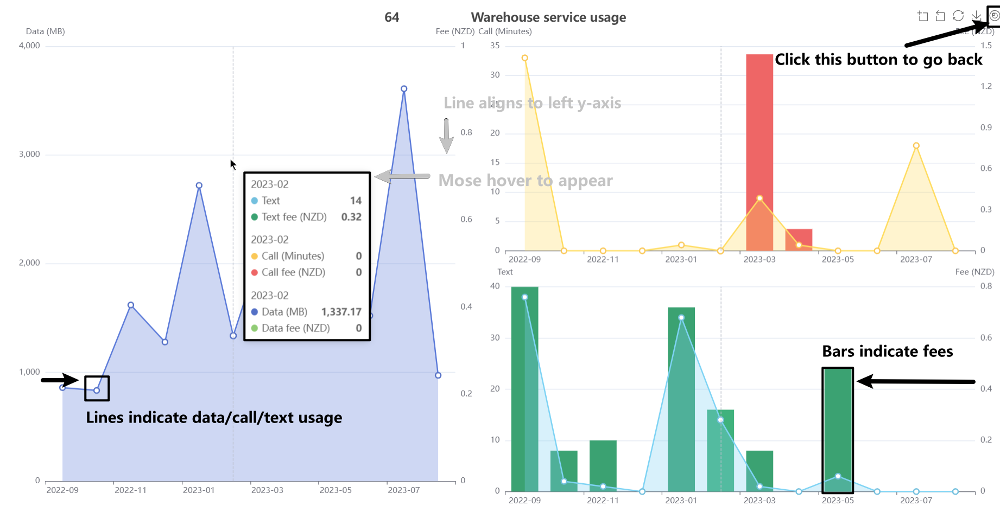

# Warehouse mobile statistics

 Statistics the usage of warehouse mobile data, call, and text


## Introduction

Warehouse mobile provides detailed usage information on their website. However, we cannot check the sum of data, texts, and phone call did we use. It also doesn't allow copying text directly from the web page, and we're hard to statistic. This program is a tool to statistics the usage of warehouse mobile service.

<details>
    <summary>Screenshot</summary>
    
</details>

## Usage

**Source code:**

1. Set the project root as the current folder in terminal. 

2. Activate Python virtual environment if applicable.

3. Run the following script. 

   ```bash
   pip install -r requirements.txt
   # pyi-makespec app.py  # generate app.spec
   python -m flask run 
   ```

It occupies localhost 5000 port by default.

- [Customize host of Flask application](https://flask.palletsprojects.com/en/2.3.x/quickstart/)
- [Customize port of Flask application](https://flask.palletsprojects.com/en/2.3.x/server/#address-already-in-use)

**Release:**

1. Download and unzip the release.
2. Open `Warehouse Mobile Statistics.exe`.
3. We preserve your password in a SQLite3 database locally, default address is `warehouse_mobile.db` of the project root.
4. When using this software for the first time, it takes several minutes to download data from warehouse mobile website.

<details>
    <summary>Screenshot</summary>
    
</details>

**Update from previous version (after v0.2.0):**

Copy `warehouse_mobile.db` to the project root of new version, otherwise you will lose your data.
