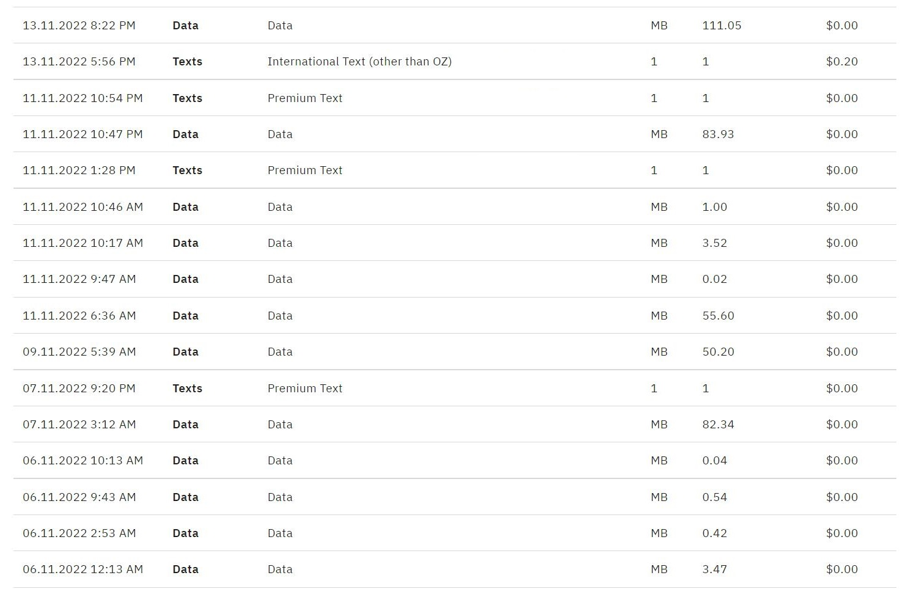
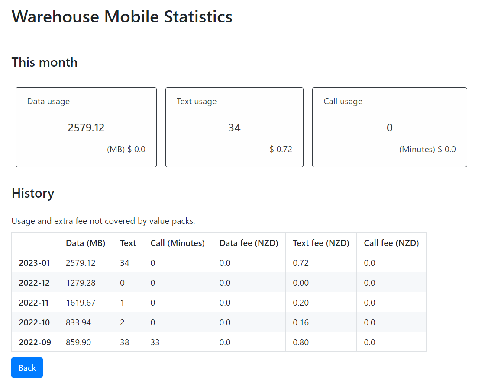

# Warehouse Mobile Statistics

 Statistics the usage of warehouse mobile data, call, and text

## Introduction

Warehouse mobile provides detailed information for customers on their website, as the following picture.

However, it doesn't provide a statistics function and let customers to check how much data, how many texts, and how long of phone call did they use. Moreover, it forbids copying text directly from the web page, making it harder to statistics.

This program is a tool to statistics the usage of warehouse mobile service. The results are shown like the following picture.

When you use this software for the first time, it takes several minutes to download data from warehouse mobile website. After that, it updates the data of current month only, and it will not take much time.

## Usage

1.   Unzip the released software.
2.   Find `main/Warehouse Mobile Statistics.exe` and open it.

This software does not preserve your password, but it preserves your username and usage records. If you want to clear your personal data, delete everything in `raw/` directory in the installation root directory.

To clear the cache: delete `raw/` directory in root directory of this program.
